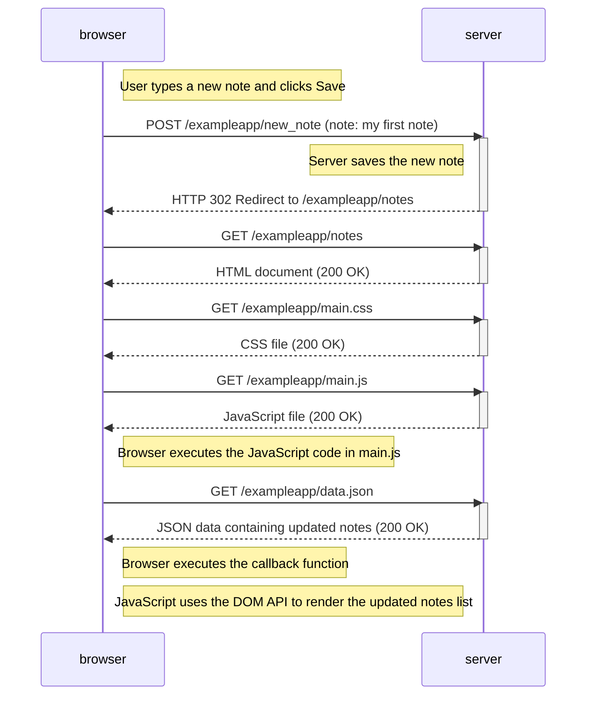

# Exercise 0.4:

```mermaid
sequenceDiagram
    participant browser
    participant server

    Note right of browser: User types a new note and clicks Save

    browser->>server: POST /exampleapp/new_note (note: my first note)
    activate server
    Note left of server: Server saves the new note
    server-->>browser: HTTP 302 Redirect to /exampleapp/notes
    deactivate server

    browser->>server: GET /exampleapp/notes
    activate server
    server-->>browser: HTML document (200 OK)
    deactivate server

    browser->>server: GET /exampleapp/main.css
    activate server
    server-->>browser: CSS file (200 OK)
    deactivate server

    browser->>server: GET /exampleapp/main.js
    activate server
    server-->>browser: JavaScript file (200 OK)
    deactivate server

    Note right of browser: Browser executes the JavaScript code in main.js

    browser->>server: GET /exampleapp/data.json
    activate server
    server-->>browser: JSON data containing updated notes (200 OK)
    deactivate server

    Note right of browser: Browser executes the callback function
    Note right of browser: JavaScript uses the DOM API to render the updated notes list
```