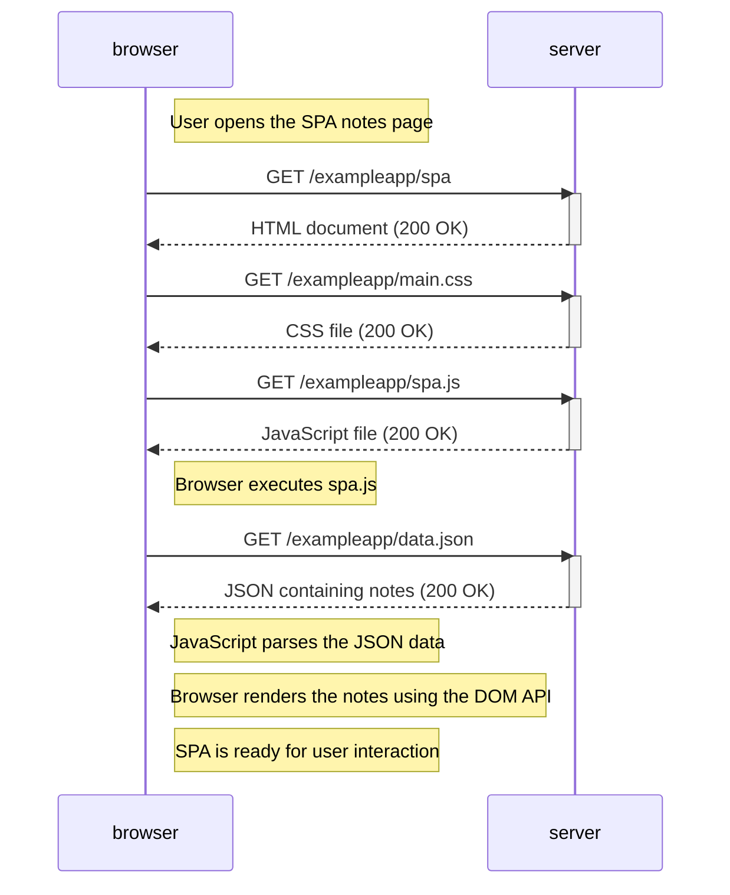

# Exercise 0.5: 

```mermaid
sequenceDiagram
    participant browser
    participant server

    Note right of browser: User opens the SPA notes page

    browser->>server: GET /exampleapp/spa
    activate server
    server-->>browser: HTML document (200 OK)
    deactivate server

    browser->>server: GET /exampleapp/main.css
    activate server
    server-->>browser: CSS file (200 OK)
    deactivate server

    browser->>server: GET /exampleapp/spa.js
    activate server
    server-->>browser: JavaScript file (200 OK)
    deactivate server

    Note right of browser: Browser executes spa.js

    browser->>server: GET /exampleapp/data.json
    activate server
    server-->>browser: JSON containing notes (200 OK)
    deactivate server

    Note right of browser: JavaScript parses the JSON data
    Note right of browser: Browser renders the notes using the DOM API
    Note right of browser: SPA is ready for user interaction
```